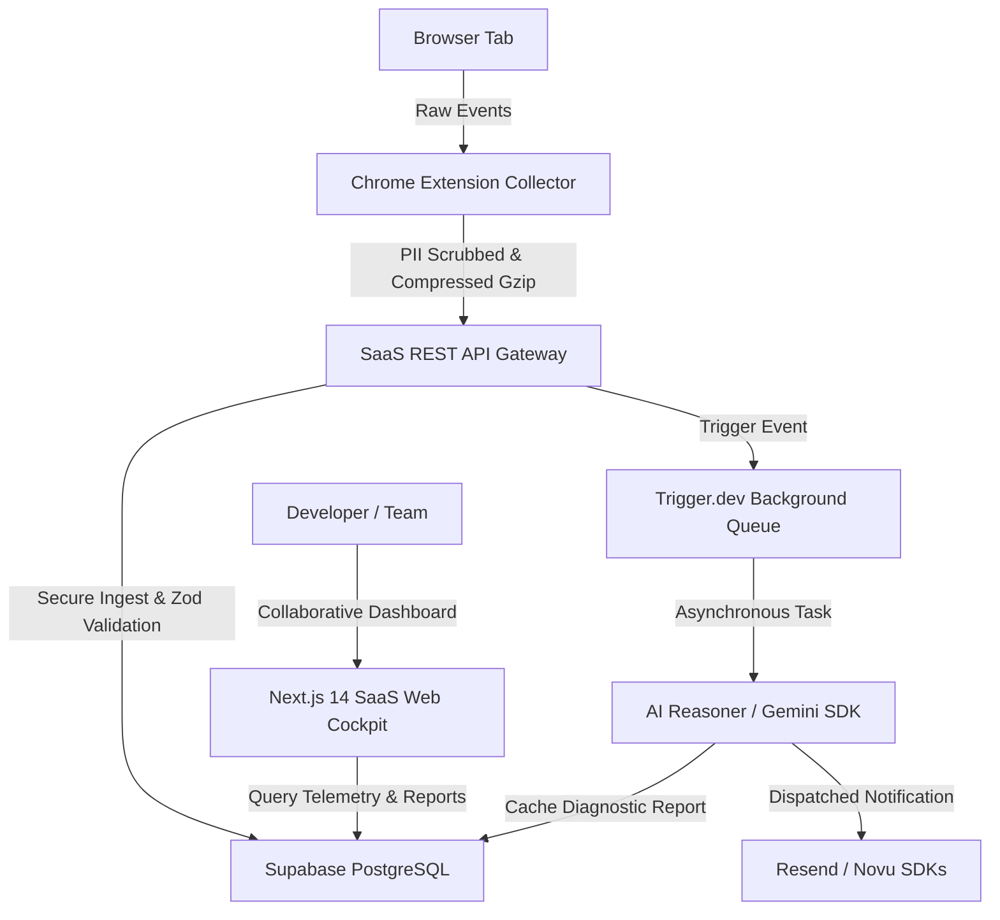

# 🚀 DebugBit v2.0 — Enterprise SaaS Developer Intelligence Platform

Welcome to **DebugBit v2.0**, a professional, enterprise-grade AI-powered Developer Intelligence Platform. DebugBit bridges the gap between raw browser telemetry and actionable engineering insights. It captures browser activity, correlates network and execution logs, identifies root causes with serverless AI models, and provides a multi-tenant collaboration cockpit.

---

## 🌟 Platform Architecture Overview

DebugBit v2.0 is designed as a hybrid local-first collector and cloud-based analytics system:



---

## 🛠️ Repository Directory Structure

The repository is organized into two primary workspaces:

*   **`src/` & Root Directory**: The Chrome DevTools Extension collector client codebase.
*   **`saas/`**: The Next.js 14 corporate web application containing the telemetry receiver, dashboard analytics charts, and billing integrations.

```text
├── src/                      # Chrome Extension Collector Codebase
│   ├── bg/                   # Background Service Workers
│   │   └── background.ts     # Extension Life-Cycle and Message Handlers
│   ├── core/                 # Core Instrumentation Engines
│   │   ├── collectors/       # Console, Network, & Performance Observers
│   │   ├── sync/             # Gzip compression and PII scrubbing
│   │   └── storage/          # Local Dexie.js (IndexedDB) schemas
│   └── views/                # React collector panel views and layouts
├── saas/                     # Next.js 14 Enterprise SaaS App Router
│   ├── src/
│   │   ├── app/              # App Router Pages & API Gateways
│   │   │   ├── api/          # Webhook receivers (Clerk, Stripe, Sync, Billing)
│   │   │   ├── dashboard/    # Collaborative Session Inspector Cockpit UI
│   │   │   ├── sign-in/      # Custom styled Clerk login pages
│   │   │   └── sign-up/      # Custom styled Clerk registration pages
│   │   ├── lib/              # SDK Core clients (Trigger, Stripe, Resend, Novu, PostHog, Sentry)
│   │   └── supabase/         # PostgreSQL DDL migrations & schema structures
└── dist/                     # Compiled production-ready extension package
```

---

## ✨ Enterprise Feature Set

### 1. High-Performance Client-Side Collector
*   **Zero-Overhead Capturing**: Listens dynamically to network streams, error logs, and Web Vitals metrics.
*   **Dexie.js IndexedDB Store**: Implements local-first storage buffering for network-disconnected states.
*   **Strict Local-Only Privacy Mode**: Client toggle skips SaaS syncing completely, ensuring data never leaves local storage.
*   **Native Gzip payload Compression**: Utilizes modern browser `CompressionStream` to compress payloads by up to 85% prior to wire transit.

### 2. Scalable Serverless Sync API
*   **Gzip Auto-Decompression**: Next.js POST receiver parses and inflates compressed telemetry arrays using built-in `zlib` stream handlers.
*   **Zero-Trust Security**: Validates all incoming parameters against strict Zod schema layouts to block database injection vectors.

### 3. Non-Blocking AI Reasoning Engine (Trigger.dev)
*   **Asynchronous Processing**: Responds `202 Accepted` to client uploads immediately; pushes heavy LLM analysis onto background worker queues.
*   **Contextual Gemini Prompts**: Feeds raw console, network, and latency sequences into specialized prompt factories to generate root-cause reports with confidence levels.

### 4. Multi-Tenant Collaboration Cockpit Dashboard
*   **Premium Dark UI**: Built with Tailwinds HSL customized palettes, responsive navigation headers, and custom Web Vitals telemetry SVG charts.
*   **Public Session Sharing**: Instantly generate encrypted public URLs to share session timelines with stakeholders.
*   **Teammate Thread Feeds**: Pin annotations and comments on individual logs for team review.

### 5. Corporate Subscription Billing (Stripe)
*   **Signature-Verified Webhook**: Decodes Stripe events to safely modify customer quotas and tiers (Free, Pro, Team).
*   **Seamless Management**: Embedded Customer Billing Portals let teams configure payment cards and print invoices directly.

### 6. Transactional Mail Alerts (Resend + Novu)
*   **In-App Alerts**: Integrates Novu for real-time dashboard notification toasts.
*   **Responsive HTML Templates**: Sends gorgeous, brand-customized HTML newsletters for welcome boarding, organizational invitations, and AI diagnostic completions.

---

## 🚀 Step-by-Step Installation & Local Setup

### 📦 Chrome Extension Client Setup

1.  **Install dependencies and compile the workspace**:
    ```bash
    # Run in the root directory
    npm install
    npm run build
    ```
2.  **Load the compiled extension into Chrome**:
    *   Open Google Chrome and navigate to `chrome://extensions/`.
    *   Enable **Developer mode** (toggle in the top-right corner).
    *   Click **Load unpacked** in the top-left.
    *   Select the compiled **`dist/`** folder inside this repository root.

---

### 🌐 Next.js SaaS Backend Setup

1.  **Configure environment variables**:
    Create a `saas/.env.local` file containing your production SaaS keys:
    ```env
    # Supabase Connection Variables
    NEXT_PUBLIC_SUPABASE_URL=your-supabase-url
    NEXT_PUBLIC_SUPABASE_ANON_KEY=your-supabase-anon-key
    SUPABASE_SERVICE_ROLE_KEY=your-supabase-service-role-key

    # Clerk Identity Keys
    NEXT_PUBLIC_CLERK_PUBLISHABLE_KEY=your-clerk-publishable-key
    CLERK_SECRET_KEY=your-clerk-secret-key
    CLERK_WEBHOOK_SECRET=your-clerk-webhook-secret

    # Trigger.dev Background Worker Keys
    TRIGGER_API_KEY=your-trigger-dev-api-key

    # Stripe Payment API Keys
    STRIPE_SECRET_KEY=your-stripe-secret-key
    STRIPE_WEBHOOK_SECRET=your-stripe-webhook-secret

    # Transactional Email Key
    RESEND_API_KEY=your-resend-api-key
    ```

2.  **Initialize PostgreSQL Relational Schemas**:
    Apply the DDL migration scripts inside [`saas/supabase/migrations/`](file:///c:/Users/HP%20USER/Desktop/Aminai%20Technologies/Projects/AI%20Debugging%20Copilot/saas/supabase/migrations/) or initialize using:
    ```bash
    # Run inside the saas directory
    npx supabase db push
    ```

3.  **Run the Next.js development server**:
    ```bash
    cd saas
    npm install
    npm run dev
    ```
    Your dashboard will run locally at **`http://localhost:3000`**.

---

## 🧪 Security & Data Compliance Standards

*   **PII Sanitization**: Scrubbing scripts intercept and mask authorization headers, cookies, passwords, and sensitive fields before sending payload arrays.
*   **Payload Encryption**: Content transmitted over HTTPS is fully encrypted.
*   **API Authentication Gates**: All synchronizations require active project API keys, validated using indexed queries.

---

## 👥 Authors & Contributions

DebugBit v2.0 is maintained by the Lead Architect and Principal Engineers at **Aminai Technologies**. For support or enterprise license inquiries, please open a ticket on your workspace support channel.
