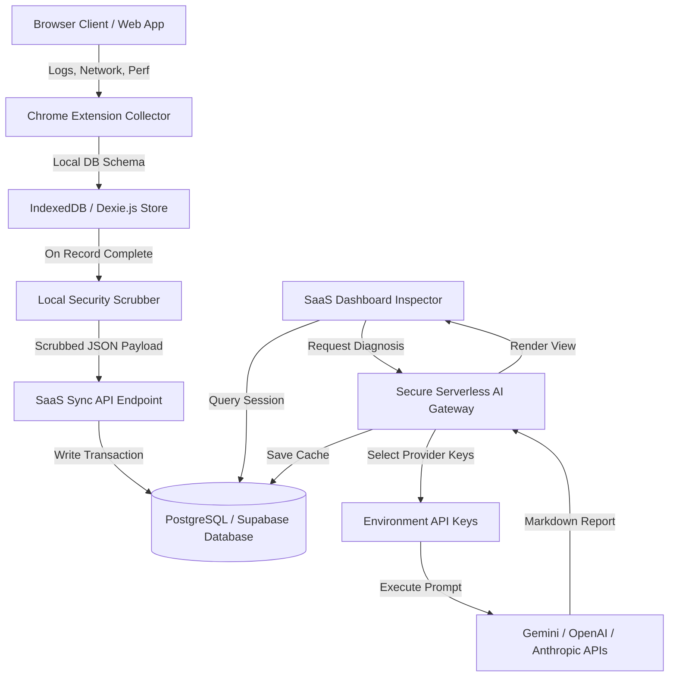

# 🚀 DebugBit Enterprise SaaS Platform - Technical Architecture

DebugBit is a scalable, enterprise-grade AI-powered Developer Intelligence SaaS platform. It combines high-speed, local-first browser extension telemetry collection with a central cloud synchronization hub and a zero-trust, serverless AI analysis gateway.

---

## 🏗️ System Architecture Model



---

## 🗄️ Database Schemas & Migrations

Central databases are hosted on **PostgreSQL / Supabase** using structured cascade references and lookup optimization indexing.
Refer to [**`schema.sql`**](file:///c:/Users/HP%20USER/Desktop/Aminai%20Technologies/Projects/AI%20Debugging%20Copilot/saas/schema.sql) for full execution queries.

### Core Tables List
1.  **`teams`**: Represents enterprise tenant environments.
2.  **`users`**: Mirrored security model mapped directly from Supabase Authentication instances.
3.  **`team_members`**: Handles organizational membership and security access controls (`owner`, `admin`, `member`).
4.  **`projects`**: Sub-workspace target containing unique API keys connecting external Chrome Extensions to active projects.
5.  **`sessions`**: Root metadata storing unique UUID-based tracking sessions synced from client extensions.
6.  **`console_logs`**: Synced browser standard console warnings, errors, exceptions, and call stacks.
7.  **`network_logs`**: Synced HTTP request/response lifecycles, duration metrics, headers, and payloads.
8.  **`performance_metrics`**: Standardized paint timings and Core Web Vitals (FCP, LCP, FID).
9.  **`ai_reports`**: Cached root-cause analysis markdown files.

---

## 🔒 Zero-Trust Security & PII Redaction

To prevent sensitive intellectual property, authorization tokens, or customer data from ever hitting public networks:
1.  **Client-Side Sandboxed Scrubbing**: The extension invokes [`scrubber.ts`](file:///c:/Users/HP%20USER/Desktop/Aminai%20Technologies/Projects/AI%20Debugging%20Copilot/src/core/sync/scrubber.ts) before any telemetry leaves local memory. It filters HTTP headers (`Bearer`, `Basic`, `OAuth`), cookies, URLs, credit cards, and SSNs.
2.  **Serverless Key Isolation**: Chrome Extension clients never store or communicate with corporate AI keys. Instead, they make authenticated REST handshakes to the Next.js SaaS backend, which queries backend-only environment variables (`GEMINI_API_KEY`, etc.) inside secure host runtime shells.

---

## ⚙️ SaaS Next.js Serverless Routes

### 1. Centralized Sync Pipeline: `/api/sync`
-   **Method**: `POST`
-   **Security**: Authenticates client request using the project's unique `apiKey`.
-   **Handler**: Resolves project ownership, initializes/upserts session records, and executes rapid PostgreSQL bulk writes.

### 2. Multi-Provider AI Analyzer Gateway: `/api/analyze`
-   **Method**: `POST`
-   **Security**: Restrictive SaaS Project validation check.
-   **Handler**: Invokes the abstract provider factory inside [`aiFactory.ts`](file:///c:/Users/HP%20USER/Desktop/Aminai%20Technologies/Projects/AI%20Debugging%20Copilot/saas/src/lib/providers/aiFactory.ts) to execute prompts using the requested AI provider, saving the returned diagnostics into the historical `ai_reports` database.

---

## 🚀 Getting Started & Local Setup

### 1. Local Prerequisites
-   Ensure **Node.js v18.0+** is installed on your development machine.
-   A running PostgreSQL instance (or free **Supabase** database).

### 2. Database Setup
Execute the migration scripts inside your PostgreSQL database console:
```bash
psql -U your_db_user -d your_db_name -f schema.sql
```

### 3. Environment Configurations
Create a `.env.local` file inside the `saas/` folder:
```env
# Supabase DB Connections
NEXT_PUBLIC_SUPABASE_URL=https://your-supabase-app-url.supabase.co
SUPABASE_SERVICE_ROLE_KEY=your-supabase-secret-service-role-key

# Secure AI Provider API Keys
GEMINI_API_KEY=your_gemini_api_key
OPENAI_API_KEY=your_openai_api_key
ANTHROPIC_API_KEY=your_anthropic_api_key
```

### 4. Running the Project
Navigate to the SaaS workspace and launch the Next.js development server:
```bash
cd saas
npm install
npm run dev
```

Open [**`http://localhost:3000`**](http://localhost:3000) in your browser to inspect the live telemetry analysis platform.
